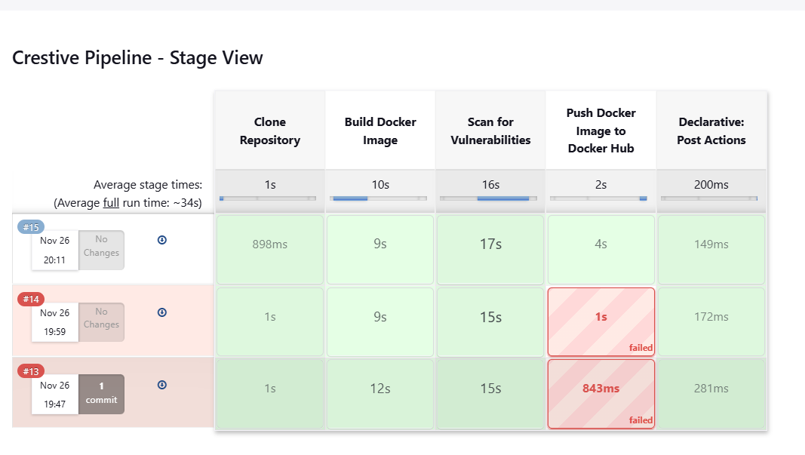
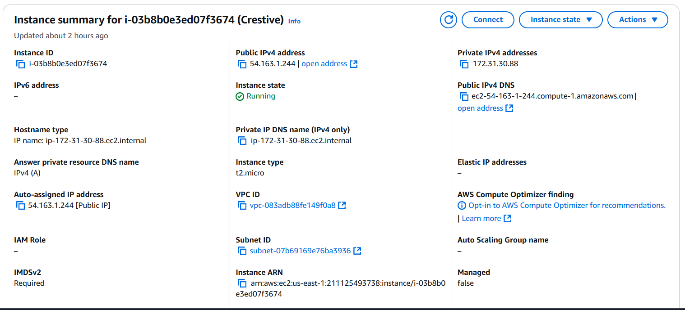

# Flask Application with Docker

This project demonstrates how to build and run a Flask application in a Docker container.

## Prerequisites

Make sure the following are installed on your system:

- Python 3.x
- pip (Python package manager)
- Docker

## Setup Instructions

### Step 1: Install Dependencies

Install Flask and Werkzeug (if not already installed) using pip:

```bash
pip install flask werkzeug

docker build -t crestive .
docker run -d -p 5000:5000 crestive

```
For Pipeline, Setup 
Docker Hub Credentials: Add your Docker Hub credentials in Jenkins:

Go to Manage Jenkins > Manage Credentials.
Add a username with password credential, ID, Description


## Pipeline Stage



# EC2 Instance Details

